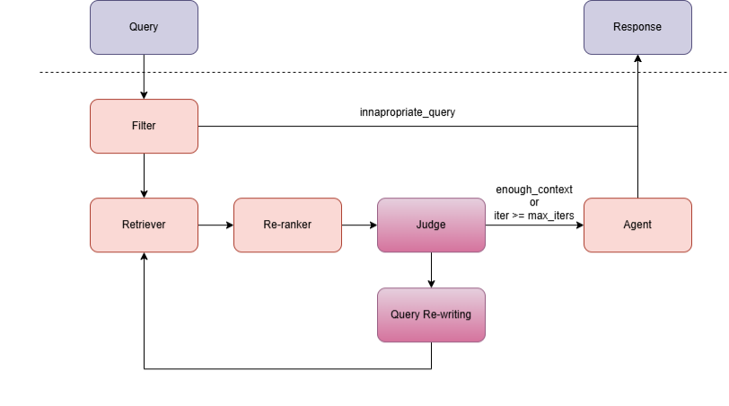
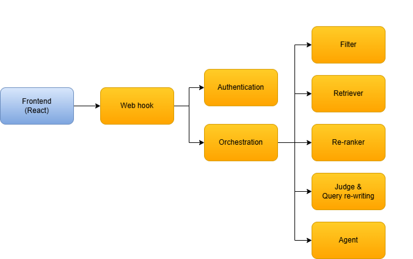

# AI_Engineer_course
Source code of my Coderhouse AI Engineer course submission.

## 🔐 Environment Variables

Copy in an `.env` file in the root of the project and fill in the values for the following environment variables:
```
LANGSMITH_TRACING=true
LANGSMITH_ENDPOINT=https://api.smith.langchain.com
LANGSMITH_API_KEY=<YOUR_LANGSMITH_API_KEY>
LANGSMITH_PROJECT=<YOUR_LANGSMITH_PROJECT>
AZIRE_API_KEY=<YOUR_AZIRE_API_KEY>
AZIRE_SPACE_ID=<YOUR_AZIRE_SPACE_ID>
ARIZE_PROJECT_NAME=<YOUR_ARIZE_PROJECT_NAME>
OPENAI_API_KEY=<YOUR_OPENAI_API_KEY>
ADMIN_USER_USERNAME=<CHOOSE_AN_ADMIN_USER_USERNAME>
ADMIN_USER_PASSWORD=<CHOOSE_AN_ADMIN_USER_PASSWORD>
ENCRYPTION_SECRET_KEY=<CHOOSE_YOUR_ENCRYPTION_SECRET_KEY>
DEBUG=true
```

Description of the environment variables used in the application:
- `LANGSMITH_TRACING`: Enables tracing for LangSmith API calls.
- `LANGSMITH_ENDPOINT`: The endpoint for the LangSmith API. 
- `LANGSMITH_API_KEY`: Your API key for LangSmith.
- `LANGSMITH_PROJECT`: The project name for LangSmith.
- `AZIRE_API_KEY`: Your API key for Azire.
- `AZIRE_SPACE_ID`: The space ID for Azire.
- `ARIZE_PROJECT_NAME`: The project name for Arize.
- `OPENAI_API_KEY`: Your API key for OpenAI.
- `ADMIN_USER_USERNAME`: The username for the admin user. It could be "admin".
- `ADMIN_USER_PASSWORD`: The password for the admin user. It could be "123".
- `ENCRYPTION_SECRET_KEY`: A secret key used for encryption. It should be generate using python -c "import secrets; print(secrets.token_hex(16))".


## 💻🖥️💻 Option 1: Deployment using Kubernetes

### 1. Verify kubernetes cluster is created
Kubernetes must be installed and a cluster must be created in order to run the application.

```
kubectl cluster-info
```

### 2. Verify that secret (environment variables) is created.
You must create a secret file from the .env file in order to run the application. 
This scripts converts a .env file into a secret in Kubernetes.

```
kubectl create secret generic nau-secret --from-env-file=.env -n nau-ai
```

### 3. Create the namespace, deployment, and service in Kubernetes 
```
kubectl apply --recursive -f deployment/
```

### 4. Ensure ports are forwarded to the local machine
Using different consoles:

```
kubectl port-forward service/frontend 5173:5173 -n nau-ai
```

```
kubectl port-forward service/hook 1235:1235 -n nau-ai
```

### 5. Verify that the configuration is correct and the pods are running
Get information from the different resources in the Kubernetes cluster.
```
kubectl get namespaces
```

```
kubectl get deployments -n nau-ai
```

```
kubectl get pods -n nau-ai
```

```
kubectl get services -n nau-ai
```


Get information from a particular pod in the Kubernetes cluster.

```
kubectl describe pod <POD_NAME> -n nau-ai
```

```
kubectl logs <POD_ID> -n nau-ai
```

### 6. If anything goes wrong
You can delete the deployment and start over by running the following command:
```
kubectl delete deployment -n nau-ai --all
```

### 7. If you change the source code of the application
In order to build and push docker images to dockerhub, which are then pulled by Kubernetes, you must be logged in to dockerhub and run the following command:
```
python push_docker_containers.py --username <DOCKERHUB_USERNAME>
```

## 🐳 Option 2: Deployment using Docker compose
### 1. Build and run the docker images
```
docker compose --build up
```

## 🐍⚛️ Option 3: Deployment using vanilla python & React
### 1. Install dependencies
For the backend:
```
pip install -r requirements.txt
```

Note: This method inicializes a monolithic Python application, importing the methods of the application instead of making API calls. This is used for less expensive deployments, such as on AWS. It is also possible to run each microservice independently, but this requires more resources and is more costly.

```
cd <MICROSERVICE_FOLDER>
pip install -r requirements.txt
```

For the frontend:
```
cd frontend/my-app
npm install
```


### 2. Run the application

Para correr el backend en un solo servidor:
```
python app.py
```

To run every microservice independently:
```
cd <MICROSERVICE_FOLDER>
python app.py
```

```
cd frontend/my-app
npm run dev
```

## 💫 Option 4: Deploy to Netlify & AWS

### Deploying the application for the first time

**Netlify**:
- Build the frontend using `npm run build` in the `frontend/my-app` folder.
- Deploy the frontend to Netlify. You can use the `frontend/my-app/dist` folder as the source for the deployment.

**AWS**:
- Initialize an EC2 instance and install the required dependencies using `./aws_deploy/setup_project.sh`.
- Buy a domain name and create a hosted zone in Route53.
- Associate the domain name with an Elastic IP and point the Elastic IP to the EC2 instance.
- Copy the environment variables from the `.env` file to the EC2 instance.
- Setup the reverse proxy using `./aws_deploy/setup_nginx.sh`.
- Setup the HTTPS certificate using `./aws_deploy/setup_https.sh`.
- Create a virtual environment using `python3 -m venv nau_ai`. It's important to use that name for the virtual environment, as it is used in the `nauai.service` file.
- Copy the file `nauai.service` to `/etc/systemd/system/nauai.service` in the EC2 instance. Remember to use sudo to copy the file.
- Incorporate inside the header http: limit_req_zone $binary_remote_addr zone=general:10m rate=30r/m; in the `/etc/nginx/nginx.conf` file. Remember to use sudo to edit the file.
- Start the service using `sudo systemctl daemon-reload`,  `sudo systemctl enable nauai` and `sudo systemctl start nauai`.
- Verify that the service is running using `sudo systemctl status nauai`.


### Making changes to nginx
If you want to change the configuration of the nginx.conf file, use: 

```
sudo systemctl reload nginx.
```

### Making changes to the service
If you want to change the configuration of the nauai.service file, use: 

```
sudo systemctl daemon-reload
sudo systemctl restart nauai
```


## 🌐 Option 5: Access to an already deployed application
You can access the deployed application at the following URL: [https://nauai.netlify.app/](https://nauai.netlify.app/)


## 🏠 Architectural decisions
### Flow of the application


### Microservices architecture of the application


The components present here are:
- **Frontend**: The frontend is a React application that allows the user to interact with the application.
- **Hook**: The hook is a FastAPI application that receives the user question and sends it to the orchestrator, and handles user authentication and authorization. The reason for having this hook is to divide the responsabilities of the orchestrator and the authentication, and having the frontend only communicate with one application.
- **Orchestrator**: The orchestrator is a FastAPI application that coordinates the different components of the application. It receives the user question from the hook and sends it to the retrieval component, then sends the retrieved documents to the ranking component, and finally sends the ranked documents to the agent component. The orchestrator also handles the communication with LangSmith and Arize for observability.
- **Filter**: The filter is a FastAPI application that filters user queries to ensure that they are appropriate and do not contain any sensitive information. It uses the `gpt-4.1-mini` model to filter the queries.
- **Retrieval**: The retrieval component is a FastAPI application that retrieves documents from the vectorial database using the user question. It uses the `text-embedding-3-small` model to generate embeddings for the user question and the documents, and then uses a hybrid search method to retrieve the most relevant documents.
- **Ranking**: The ranking component is a FastAPI application that ranks the retrieved documents using the `gpt-4.1-mini` model. It receives the retrieved documents and the user question from the orchestrator, and returns the ranked documents to the orchestrator.
- **Judge**: The judge is a FastAPI application that evaluates whether the answer generated by the agent is faithful to the retrieved documents. It uses the `gpt-4.1-mini` model to evaluate the faithfulness of the answer. It also re-writes queries to make them more specific and relevant to the retrieved documents. Its main purpose was to have at least 1 module which used cyclical loops provided by LangGraph. As it's expensive, it can be disabled using `max_iterations=0` in the module that calls it.
- **Agent**: The agent is a FastAPI application that generates an answer to the user question using the ranked documents. It uses the `gpt-4.1-mini` model to generate the answer, and it can also decide whether to retrieve more documents or not based on the ranked documents and the user question.


### Ingestion
The ingestion of documents is done using the `ingestion/ingestion.ipynb` notebook. The script uses the `text-embedding-3-small` model to generate embeddings for the documents, and then stores the embeddings in a CSV file.


### Metrics
The metrics defined for the application are:
- Latency: The time it takes for the application to respond to a request.
- Faithfulness: The percentage of answers that are faithful to the retrieved documents.
- Document precision@k: The percentage of relevant documents retrieved in the top k documents.
- Application cost: The cost of running each query. This cost can be found in LangSmith traces.

A summary of the application metrics can be found in the `evaluation/report.md` file.


New metrics can also be generated by using the `evaluation/get_llm_outputs.py`, `evaluation/calculate_metrics.py`, and `evaluation/create_report.py` scripts. The scripts will generate a new report in the `evaluation/report.md` file.


## 📝 Project requirements

### Folders for every component:
- **retrieval/**: Contains the retrieval component.
- **ranking/**: Contains the ranking component.
- **orchestation/**: Contains the orchestration component.
- **agent/**: Contains the agent component.
- **orchestation/mcp_adapters/**: Contains the MCP adapters component.
- **orchestation/observability/**: Contains the observability component.

### Documentation
- See the `README.md` file to check the architecture and how to run each module.

### Components
- Retrieval:
    - ✅ Retrieval module in `retrieval/`.
    - ❌ Vectorial database.
- Ranking:
    - ✅ Ranking module in `ranking/`.
- Orchestration:

    - ✅ Orchestration module in `orchestation/`.
    - ✅ Coordination of LLMs: For example, the re-ranker and the agent are orchestrated to work together. 
    - ❌ Use of tools.
- Agent:
    - ✅ Agent module in `agent/`.
    - ✅ Cyclic agent using LangGraph: I use a cyclic agent to decide if the retrieved documents are enough to answer the question or if it needs to retrieve more documents.
- MCP Adapters:
    - ✅ MCP adapters in `orchestation/mcp_adapters/`. I use adapters to prevent non-admin users from accessing images.
- Deployment:
    - ✅ Deployment scripts for Kubernetes created in `deployment/`.
    - ✅ Scaling: The application can be scaled by changing the number of replicas in the deployment.yaml file.
- Observability:
    - ✅ Observability module in `orchestation/observability/`.
    - ✅ LangSmith integration: I use LangSmith to collect logs, metrics and traces.
    - ✅ Arize AX integration: I use Arize to collect logs, metrics and traces.
    - ✅ Metrics defined: Latency, hallucination rate, Document precision@k.
- 🏠 Architectural decisions:
    - ✅ I haven't documented the architectural decisions and the metrics defined.
    - ✅ Deployment and monitoring process: Described in the README.md file. 